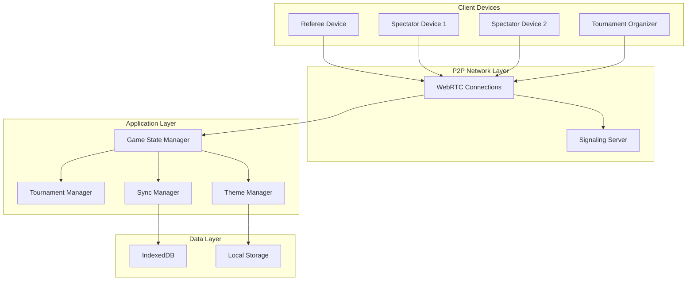

# Design Document

## Overview

The Jugger Tournament Application is a modern, responsive web application built with Next.js and React that provides comprehensive tournament management and real-time game control for Jugger sports. The application leverages WebRTC for peer-to-peer synchronization, implements Progressive Web App capabilities for offline functionality, and features a contemporary design with multiple themes.

### Key Design Principles

- **Offline-First**: Core functionality works without internet connectivity
- **Real-Time Synchronization**: Instant updates across all connected devices
- **Mobile-First Design**: Touch-optimized interface for referees and spectators
- **Modular Architecture**: Component-based design for maintainability
- **Performance Optimized**: Static generation with dynamic client-side features

## Architecture

### Technology Stack

- **Frontend Framework**: Next.js 14+ with App Router
- **UI Library**: React 18+ with TypeScript
- **Styling**: Tailwind CSS with custom component library
- **Internationalization**: next-i18next for German/English language support
- **State Management**: Zustand for global state, React Context for local state
- **Real-Time Communication**: WebRTC with Socket.IO fallback for signaling
- **Data Persistence**: IndexedDB with Dexie.js wrapper
- **PWA Features**: Next-PWA plugin for service worker and offline capabilities
- **Build & Deploy**: Static export for GitHub Pages compatibility

### System Architecture



## Components and Interfaces

### Core Components

#### 1. Tournament Dashboard
- **Purpose**: Main navigation and tournament overview
- **Features**: 
  - Tournament creation and management
  - Active matches display
  - Team management interface
  - Settings and theme selection
  - Language switcher (German/English) with German as default
- **Props Interface**:
```typescript
interface TournamentDashboardProps {
  tournaments: Tournament[]
  activeMatches: Match[]
  currentLanguage: 'de' | 'en'
  onCreateTournament: () => void
  onJoinMatch: (matchId: string) => void
  onLanguageChange: (language: 'de' | 'en') => void
}
```

#### 2. Game Control Panel
- **Purpose**: Primary interface for referees to control matches
- **Features**:
  - Jugger timer with standard timing (100 stones = ~3.5 minutes)
  - Score controls for both teams
  - Stone counter and special events
  - Match state controls (start, pause, reset, end)
- **Props Interface**:
```typescript
interface GameControlProps {
  match: Match
  isReferee: boolean
  onScoreUpdate: (team: 'home' | 'away', delta: number) => void
  onTimerControl: (action: 'start' | 'pause' | 'reset') => void
  onStoneEvent: (type: 'stone' | 'qwik') => void
}
```

#### 3. Scoreboard Display
- **Purpose**: Clean, readable display for spectators
- **Features**:
  - Large, clear score display
  - Timer with stone count
  - Team names and colors
  - Match status indicators
- **Responsive Design**: Optimized for various screen sizes

#### 4. Team Management
- **Purpose**: Create and manage team information
- **Features**:
  - Team creation with names, colors, and logos
  - Player roster management
  - Team statistics and history

#### 5. P2P Sync Manager
- **Purpose**: Handle real-time synchronization between devices
- **Features**:
  - WebRTC connection establishment
  - Conflict resolution for simultaneous updates
  - Automatic reconnection handling
  - Fallback to manual sync when needed

### State Management Architecture

#### Global State (Zustand)
```typescript
interface AppState {
  // Tournament State
  tournaments: Tournament[]
  currentTournament: Tournament | null
  
  // Match State
  activeMatches: Match[]
  currentMatch: Match | null
  
  // UI State
  currentTheme: Theme
  currentLanguage: 'de' | 'en'
  isOffline: boolean
  
  // P2P State
  connectedDevices: Device[]
  isHost: boolean
  
  // Actions
  createTournament: (tournament: Tournament) => void
  joinMatch: (matchId: string) => void
  updateScore: (matchId: string, team: 'home' | 'away', score: number) => void
  setLanguage: (language: 'de' | 'en') => void
  syncState: (state: Partial<AppState>) => void
}
```

## Data Models

### Core Entities

#### Tournament
```typescript
interface Tournament {
  id: string
  name: string
  description?: string
  format: 'single-elimination' | 'double-elimination' | 'round-robin'
  teams: Team[]
  matches: Match[]
  settings: TournamentSettings
  createdAt: Date
  updatedAt: Date
}
```

#### Match
```typescript
interface Match {
  id: string
  tournamentId: string
  homeTeam: Team
  awayTeam: Team
  score: {
    home: number
    away: number
  }
  timer: {
    stones: number
    seconds: number
    isRunning: boolean
    startedAt?: Date
  }
  status: 'pending' | 'active' | 'paused' | 'completed'
  events: GameEvent[]
  settings: MatchSettings
  createdAt: Date
  updatedAt: Date
}
```

#### Team
```typescript
interface Team {
  id: string
  name: string
  shortName: string
  color: string
  logo?: string
  players: Player[]
  stats: TeamStats
}
```

#### Game Event
```typescript
interface GameEvent {
  id: string
  matchId: string
  type: 'score' | 'stone' | 'qwik' | 'timeout' | 'penalty'
  team?: 'home' | 'away'
  timestamp: Date
  data: Record<string, any>
}
```

### Jugger-Specific Rules Implementation

#### Timer Logic
- Standard match: 100 stones (~3.5 minutes)
- Stone interval: ~2.1 seconds
- Qwik (quick stone): Immediate stone count
- Pause/resume functionality for timeouts

#### Scoring System
- Points per stone run
- Team-based scoring
- Event tracking for statistics

## Internationalization

### Language Support
- **Default Language**: German (de)
- **Secondary Language**: English (en)
- **Implementation**: next-i18next with JSON translation files
- **Fallback Strategy**: English text if German translation missing
- **Persistence**: Language preference stored in localStorage

### Translation Structure
```typescript
// locales/de/common.json
{
  "tournament": {
    "create": "Turnier erstellen",
    "name": "Turniername",
    "teams": "Teams"
  },
  "match": {
    "start": "Spiel starten",
    "pause": "Pausieren",
    "score": "Punkte"
  },
  "timer": {
    "stones": "Steine",
    "minutes": "Minuten",
    "seconds": "Sekunden"
  }
}
```

### Language Switcher Component
- **Location**: Header navigation and settings page
- **Visual**: Flag icons or text labels (🇩🇪 Deutsch / 🇺🇸 English)
- **Behavior**: Immediate language change with state persistence
- **Accessibility**: Proper ARIA labels and keyboard navigation

## Error Handling

### Network Connectivity
- **Offline Detection**: Service worker monitors connectivity
- **Graceful Degradation**: Core functionality continues offline
- **Sync Queue**: Queue updates for when connectivity returns
- **Conflict Resolution**: Last-write-wins with referee priority

### P2P Connection Issues
- **Connection Timeout**: 30-second timeout with retry logic
- **Signaling Failures**: Fallback to manual room codes
- **Data Corruption**: Checksum validation for critical updates
- **Device Disconnection**: Automatic cleanup and reconnection

### Data Persistence Errors
- **IndexedDB Failures**: Fallback to localStorage
- **Storage Quota**: Automatic cleanup of old tournament data
- **Corruption Recovery**: Data validation and repair mechanisms

## Testing Strategy

### Unit Testing
- **Component Testing**: React Testing Library for UI components
- **State Management**: Zustand store testing
- **Utility Functions**: Jest for pure functions and helpers
- **P2P Logic**: Mock WebRTC connections for sync testing

### Integration Testing
- **User Flows**: End-to-end tournament creation and match management
- **Cross-Device Sync**: Simulated multi-device scenarios
- **Offline Functionality**: Service worker and PWA feature testing
- **Performance**: Lighthouse audits for web vitals

### Manual Testing Scenarios
- **Tournament Setup**: Create tournament with multiple teams
- **Match Control**: Full match lifecycle from start to completion
- **Multi-Device Sync**: Real-time updates across devices
- **Theme Switching**: Visual consistency across all themes
- **Offline Usage**: Core functionality without internet

## Performance Considerations

### Optimization Strategies
- **Code Splitting**: Route-based and component-based splitting
- **Image Optimization**: Next.js Image component with WebP support
- **Bundle Analysis**: Regular bundle size monitoring
- **Lazy Loading**: Non-critical components and translations loaded on demand
- **i18n Optimization**: Only load active language bundle, lazy load secondary language

### Real-Time Performance
- **Debounced Updates**: Prevent excessive sync messages
- **Efficient Diffing**: Only sync changed data
- **Connection Pooling**: Reuse WebRTC connections when possible
- **Memory Management**: Cleanup old match data and connections

### Mobile Performance
- **Touch Optimization**: Large touch targets (44px minimum)
- **Gesture Support**: Swipe navigation and touch controls
- **Battery Efficiency**: Minimize background processing
- **Network Efficiency**: Compress sync data and batch updates